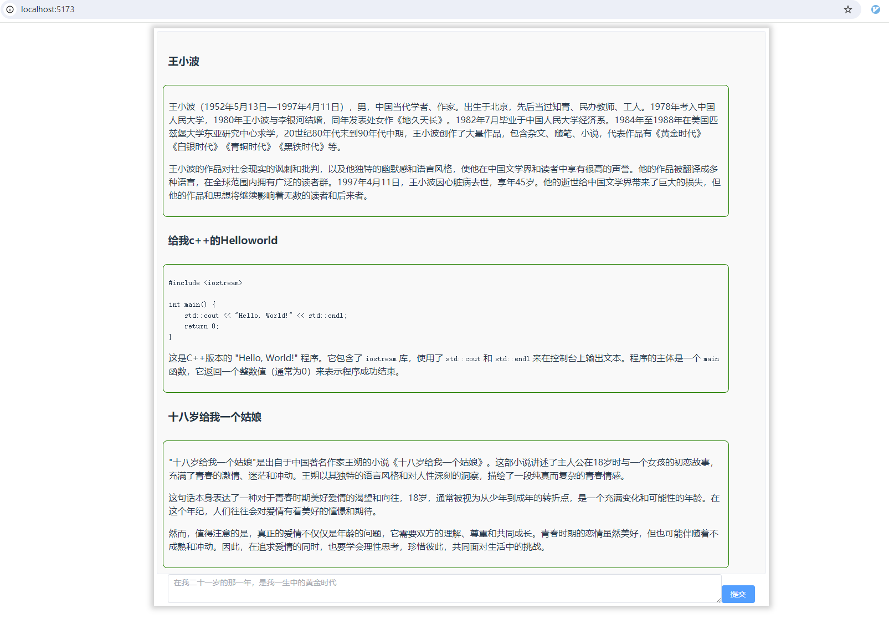

# 智能聊天

chat_ali_server.py 为服务端  ,需要配置自己的 阿里 API_KEY , URL

[阿里云配置方式](https://help.aliyun.com/zh/dashscope/developer-reference/use-qwen-by-api?spm=5176.21213303.J_qCOwPWspKEuWcmp8qiZNQ.47.22d92f3d1kS6rM&scm=20140722.S_help@@%E6%96%87%E6%A1%A3@@2399481._.ID_help@@%E6%96%87%E6%A1%A3@@2399481-RL_%E5%8D%83%E9%97%AE-LOC_llm-OR_ser-V_3-RE_new2@@cardOld-P0_1)

剩下的是 客户端 修改 src/store/index.js 中 serverhost 变量的值

npm i 
npm run dev

应该就可以了

如需定制开发， 联系: 18841685054

